<!-- ✨ Animated Banner ✨ -->
<picture>
  <source media="(prefers-color-scheme: dark)" srcset="./dishant-banner.svg?v=1">
  <source media="(prefers-color-scheme: light)" srcset="./dishant-banner-light.svg?v=1">
  
</picture>

<!-- 🌗 Profile Card (Dark / Light) -->
<picture>
  <source media="(prefers-color-scheme: dark)" srcset="./dishant-profile-dark.svg">
  <source media="(prefers-color-scheme: light)" srcset="./dishant-profile-light.svg">
  
</picture>

 

<table align="center" border="0">
<tr>
<td width="38%" align="center" valign="middle">

<!-- 🪪 Swinging Lanyard ID Card -->

</td>
<td width="62%" valign="middle">

### 🚀 My Featured Projects

| 🏆 Project | 💻 Tech | ⭐ |
|:---|:---:|:---:|
| [🤖 Hyreso — AI Mock Interview Platform](https://github.com/DishantShahare358) | `Flutter` `AI` `Flask` | ⭐ |
| [🌾 Crop Bazar — Agricultural Marketplace](https://github.com/DishantShahare358) | `Flutter` `Backend` `SQL` | ⭐ |
| [📝 Automatic Caption Generator](https://github.com/DishantShahare358) | `CNN` `LSTM` `Python` | ⭐ |
| [🤟 AI Sign Language Generation System](https://github.com/DishantShahare358) | `Flask` `ML` `NLP` | ⭐ |
| [🎨 Air Canvas — Computer Vision](https://github.com/DishantShahare358) | `OpenCV` `Python` | ⭐ |
| [👤 Face Recognition System](https://github.com/DishantShahare358) | `PCA` `Python` `CV` | ⭐ |

 

> 💡 *"Building beautiful Flutter apps today while creating AI-powered solutions for tomorrow."*

</td>
</tr>
</table>

 

<!-- 🛠️ Skills (Dark / Light) -->
<picture>
  <source media="(prefers-color-scheme: dark)" srcset="./dishant-skills.svg">
  <source media="(prefers-color-scheme: light)" srcset="./dishant-skills-light.svg">
  
</picture>

### 📊 GitHub Stats & Graphs

<!-- 📊 Custom Stats SVG -->

  

<!-- 🔥 GitHub Streak -->

  

<!-- 📈 LIVE Contribution Activity Graph -->

  

<!-- 🏆 Custom Trophies SVG -->

  

### 🐍 Watch the snake eat my contributions

<!-- Snake SVGs are auto-generated from REAL contribution data by GitHub Actions -->
<picture>
  <source media="(prefers-color-scheme: dark)" srcset="https://raw.githubusercontent.com/DishantShahare358/DishantShahare358/output/github-snake-dark.svg"/>
  <source media="(prefers-color-scheme: light)" srcset="https://raw.githubusercontent.com/DishantShahare358/DishantShahare358/output/github-snake.svg"/>
  
</picture>

  

### 📫 Let's Connect

  

  

*⭐️ Always learning, always building. From Flutter to AI — the journey continues.* 🚀

